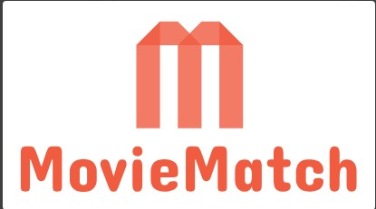
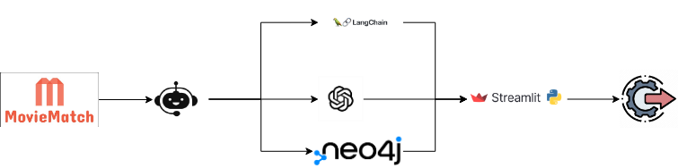

# MovieMatch - Optimised with RAG



## Welcome back to MovieMatch -  Your Personal Movie Guide

## What's New?

Optimized with RAG: We've taken MovieMatch to the next level by incorporating Retrieval-Augmented Generation (RAG). This means more powerful and precise movie recommendations using an enhanced search engine.

Graph Database: The backend now has been integrated with a graph datbase to track user behaviour easily and the movies available in our collection has also been optimised to facilitate a vector search.

Improved User Interface: Experience a cleaner, more intuitive design that simplifies navigation and enhances your movie discovery journey.

### How It Works

Integration with Custom Movies from various sources across the internet: Our new custom dataset enables detailed searches based on:

- Plot: Find movies with intriguing storylines that suit your mood.
- Ratings: Filter by ratings to ensure high-quality viewing options.
- Keywords: Search for movies with specific elements or themes you enjoy.

Advanced Search Functionality: Whether you're in the mood for a romantic classic or a hidden gem with a unique plot twist, MovieMatch's advanced search capabilities will help you find the perfect fit.

### Get Started
1. Clone the repository

2. Download Neo4j Desktop and install the [GenAI Stack](https://neo4j.com/generativeai/) which can be used to Facilitate RAG.

3. Create a python environment and install the requirements.txt

4. Create a .env file with the following parameters

```

NEO4J_URI=*****************
NEO4J_USER=*****************
NEO4J_PASSWORD=*****************
NEO4J_DATABASE=*****************
OPENAI_API_KEY=*****************
OPENAI_BASE_URL=*****************

```


5. streamlit run app.py

Enjoy the latest version of MovieMatch – your personal movie guide!

## Updated MovieMatch Framework 




